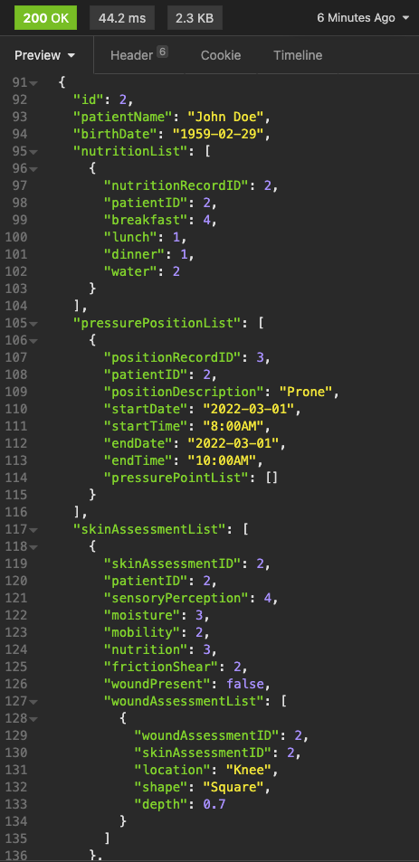

# ENSF609-610 API Documentation

## API endpoints

This is a list of the API endpoints, successful API requests always return either `HttpStatus.OK` or `HttpStatus.CREATED`. If a call is unsuccessful, the response will either be  `HttpStatus.BAD_REQUEST` or `HttpStatus.NOT_FOUND`.

---

## CORS Testing

Run the command to test for CORS compatibility with http://localhost:3000 (React App)
```
curl -v -H "Access-Control-Request-Method: GET" -H "Origin: http://localhost:3000" -X OPTIONS http://localhost:8080/patients
```

A successful response should return the following: 
  

An unsuccessful response should return the following:
  
---


1.  ## Patient End Points
    * API endpoint (GET): http://localhost:8080/patients
    * API endpoint (GET): http://localhost:8080/patients/{id}
    * API endpoint (POST): http://localhost:8080/patients
    * API endpoint (PATCH): http://localhost:8080/patients/{id}
      (Note: Only fields that can be updated here are patientName and birthDate)
    * API endpoint (DELETE): http://localhost:8080/patients/{id} 

        
---

2. ## Nutrition End Points
    * API endpoint (GET): http://localhost:8080/nutrition
    * API endpoint (GET): http://localhost:8080/nutrition/{id}
    * API endpoint (POST): http://localhost:8080/nutrition (Note Must contain a patient ID)
    * API endpoint (PATCH): http://localhost:8080/nutrition/{id} 
    * API endpoint (DELETE): http://localhost:8080/nutrition/{id} 

        
---

3. ## Pressure Position End Points
     Note: {id} references the ID of the Pressure Position Record
    * API endpoint (GET): http://localhost:8080/pressure-position
    * API endpoint (GET): http://localhost:8080/pressure-position/{id}
    * API endpoint (POST): http://localhost:8080/pressure-position (Note Must contain a patient ID)
    * API endpoint (PATCH): http://localhost:8080/pressure-position/{id} 
    * API endpoint (DELETE): http://localhost:8080/pressure-position/{id} 
    
---

4. ## Pressure Point End Points
     Note: {id} references the ID of the Pressure Point Record
    * API endpoint (GET): http://localhost:8080/pressure-point
    * API endpoint (GET): http://localhost:8080/pressure-point/{id}
    * API endpoint (POST): http://localhost:8080/pressure-point (Note Must contain a pressurePositionID)

            
---

5. ## Skin Assessment End Points
     Note: {id} references the ID of the Skin Assessment Record
    * API endpoint (GET): http://localhost:8080/skin-assessment
    * API endpoint (GET): http://localhost:8080/skin-assessment/{id}
    * API endpoint (POST): http://localhost:8080/skin-assessment (Note Must contain a patient ID)
    * API endpoint (PATCH): http://localhost:8080/skin-assessment/{id} 
    * API endpoint (DELETE): http://localhost:8080/skin-assessment/{id} 
    

    ## Note Special End Points for Skin Assessment
    
    Return the latest Skin Assessment Report for a given patient id
    * API endpoint (GET): http://localhost:8080/skin-assessment/patient/{id}
       

    Return the latest Braden Score for a given patient id
    * API endpoint (GET): http://localhost:8080/skin-assessment/bscore/{id}
       
---

6. ## Wound Assessment End Points
     Note: {id} references the ID of the Pressure Position Record
    * API endpoint (GET): http://localhost:8080/wound-assessment
    * API endpoint (GET): http://localhost:8080/wound-assessment/{id}
    * API endpoint (POST): http://localhost:8080/wound-assessment (Note Must contain a skinAssessmentID)

        
---

## Backend 
Back end is built using Spring Boot for database connectivity and Spring Security on the API end points.

### Instructions
- http://localhost:8080/ directs to backend home page - Spring Boot
- http://localhost:3000/ directs to login page - React App
